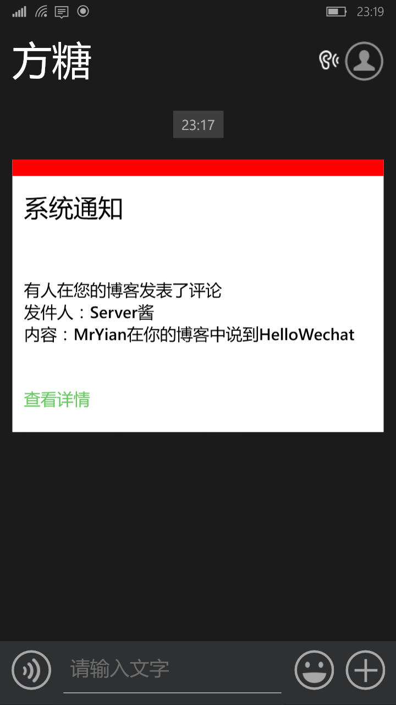

# Comment2Wechat

> Typecho 插件——新评论微信通知 

## 感谢
本插件的微信推送采用了 [@Easy](http://www.weibo.com/easy) 的 [Server酱](http://sc.ftqq.com/) 解决方案，在此特别感谢 @Easy 大大！

## 使用方法

 1. [点此下载](https://github.com/YianAndCode/Comment2Wechat/archive/master.zip)后解压，将解压后的目录名改为 `Comment2Wechat`，然后上传到你的 Typecho 的 `/usr/plugins`，并在 Typecho 后台开启插件
 2. 到[Server酱](http://sc.ftqq.com/)里申请你的专属 `SCKEY`，并根据提示绑定你的微信
 3. 将你申请到的 `SCKEY` 填到插件设置里，保存即可

 ## 截图

